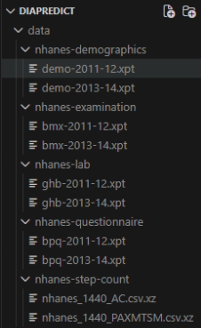

# Diapredict

## Running Our Model

Our model (and some optional scripts used to help optimize our models) are all included in `diapredict_ensemble.ipynb`. This model will not run properly without the correct data (discussed below) and dependencies. Ensure the jupyter notebook is run in a python kernel containing the dependencies outlined in `requirements.txt` (to install dependencies, run `pip install -r requirements.txt`). Once everything is properly installed, simply running all cells (optionally skipping the cells marked as "Optional") will run our model and print our results.

## The Data

Our data comes entirely from different subsets of the CDC's National Health and Nutrition Examination Survey (NHANES).
To run our model successfully, the file paths and names of the datasets inside of the `data` folder must be properly updated. Below is an image of an example file structure of how all datasets should be structured.

A google drive folder containing all relevant data in the correct configuration can be found [here](https://drive.google.com/drive/folders/1aH5_MltxgZlqqVENs3FR19ifpsSzk_pv?usp=sharing). Alternatively, hyperlinks leading to each distinct dataset used in our project are listed below.

## NHANES Demographics

- [2011-12](https://wwwn.cdc.gov/Nchs/Data/Nhanes/Public/2011/DataFiles/DEMO_G.xpt)
- [2013-14](https://wwwn.cdc.gov/Nchs/Data/Nhanes/Public/2013/DataFiles/DEMO_H.xpt)

## NHANES Examination Data (Body Measures)

- [2011-12](https://wwwn.cdc.gov/Nchs/Data/Nhanes/Public/2011/DataFiles/BMX_G.xpt)
- [2013-14](https://wwwn.cdc.gov/Nchs/Data/Nhanes/Public/2013/DataFiles/BMX_H.xpt)

## NHANES Questionnaire Data (Blood Pressure & Cholesterol)

- [2011-12](https://wwwn.cdc.gov/Nchs/Data/Nhanes/Public/2011/DataFiles/BPQ_G.xpt)
- [2013-14](https://wwwn.cdc.gov/Nchs/Data/Nhanes/Public/2013/DataFiles/BPQ_H.xpt)

## NHANES Laboratory Data (Glycohemoglobin - Ground Truth)

- [2011-12](https://wwwn.cdc.gov/Nchs/Data/Nhanes/Public/2011/DataFiles/GHB_G.xpt)
- [2013-14](https://wwwn.cdc.gov/Nchs/Data/Nhanes/Public/2013/DataFiles/GHB_H.xpt)

## Physio NHANES Step Count Data (2011-2014)

- [Activity Counts](https://physionet.org/content/minute-level-step-count-nhanes/1.0.1/csv/nhanes_1440_AC.csv.xz)
- [MIMS](https://physionet.org/content/minute-level-step-count-nhanes/1.0.1/csv/nhanes_1440_PAXMTSM.csv.xz)
